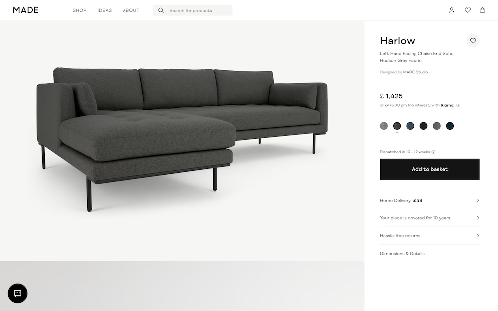
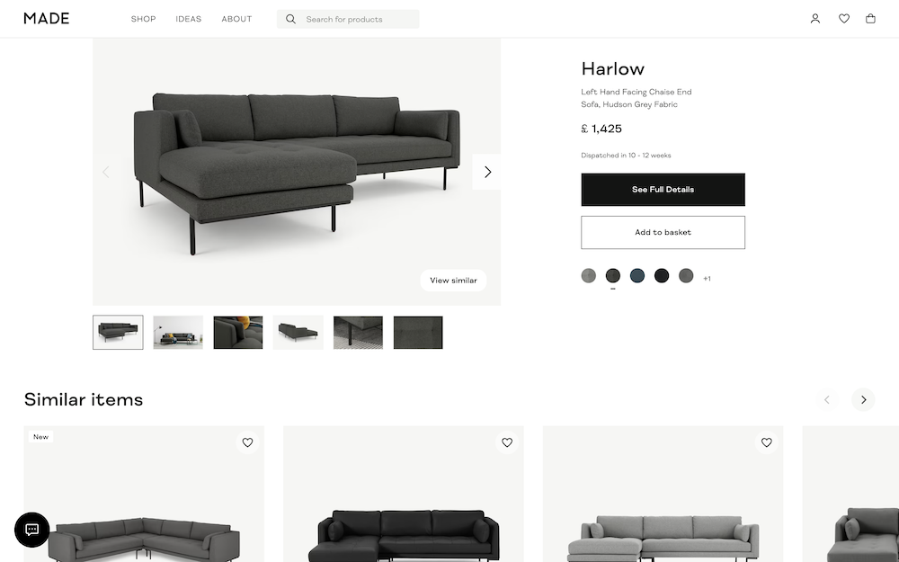

# MageQuest_PpcLandingPages

Customise your PDP (Product Detail Pages) for PPC (Pay Per Click) visitors.

<div>
    
    
    
    
</div>

## Overview
A Magento 2 module that allows for creating discrete PDP (Product Detail Pages) page layouts for customers landing on the site from a PPC (Pay Per Click) link/ad by allowing routing to the same pages using a `/ppc/` prefix in the URL path.

# Concept
The idea for this module is taken from [Made.com](https://www.made.com), where PDP pages visited from PPC adverts have different layout and content to the standard page.

For example:
* Standard PDP: [https://www.made.com/harlow-left-hand-facing-chaise-end-corner-sofa-dark-anthracite-fabric](https://www.made.com/harlow-left-hand-facing-chaise-end-corner-sofa-dark-anthracite-fabric)
  
  
* PPC Landing PDP: [https://www.made.com/ppc/harlow-left-hand-facing-chaise-end-corner-sofa-dark-anthracite-fabric](https://www.made.com/ppc/harlow-left-hand-facing-chaise-end-corner-sofa-dark-anthracite-fabric)
  
  


> Note: the `/ppc/` in the second URL after the TLD (Top Level Domain).

On the first URL we're served the default PDP page which focuses on the product in question with an almost full width gallery, lots of imagery and plenty of content to explain more about the product.

However, on the second URL we get a much smaller image, reduced information and 'add to cart' details and directly underneath the remainder of the page is dedicated to product relations and up-sells. The other key addition is a link to view the full product details (i.e. it links back to original/standard PDP page.)

## Why?
When a customer lands on your site from a PPC ad you may want to tailor content to better suit them.

Consider the following:

It may be their first visit to your site, so you may want to promote/highlight content about your brand to build trust. For example, a PPC ad generally lands a customer on the PDP page, so they may not have seen the homepage or other pages.

You may offer similar products that aren't obvious on the standard PDP so moving product relations/up-sells further up the page may be desired. For example, generally a customer coming from a PPC link has more intent to buy and if they find they don't quite like the product their first natural reaction is to hit the back button and find something else back on the search engine. However, if you can promote other similar products you've got a much better chance of their next action being selecting one of these products and staying on your site, increasing the chance of them making a purchase from you.   

## Features
* Allows all pages to accessed via a separate `/ppc/` prefixed URL path
  * This is intended to be used for PDPs, but can in theory be used on any page on the site
* Adds custom layout handles to these pages so layout and content can be modified
  * These end with a PPC suffix, e.g., for PDPs you get a `catalog_product_view_ppc` layout handle
  * For Hyvä Themes storefronts this also plays nice with their `hyva_` prefixes, e.g. `hyva_catalog_product_view_ppc`
* Provides configuration to modify meta (search engine) robots values for these pages
  * e.g. if you want to set all PPC landing pages to NOINDEX,NOFOLLOW
* Works alongside (i.e., doesn't interfere with) the default canonicalization settings
  * If default canonical links are enabled then the PPC landing pages will canonicalize back to the non PPC version of the page  

## (Batteries) Not Included
This module is not 'plug and play'. It does NOT change the layout/content on PPC landing pages, it purely facilitates the ability to do so by allowing routing using `/ppc/` prefixed URLs and adding `_ppc` suffixed layout handles.

It's up to you and your design and development team to determine how you want to layout PPC landing pages and what content you want to include by utilising the layout handles provided. However, we recommend using the [Made.com](https://www.made.com) example as inspiration if you're stuck:
* Reduce the size of the main image gallery and remove any superfluous content for first time visitors
* Remove all supporting information about the product (except for key details like price and delivery lead times) and replace with a link to view full product details
* Dedicate the rest of the page (under image and add to cart section) to displaying product relations/up-sells or perhaps featured/related categories

In addition, it does not modify anything in relation to any feeds or integrations with your shopping channels, i.e. you need to make the necessary modifications to ensure the `/ppc/` prefixed URLs are utilised (e.g. in your Google Shopping or Facebook/Instagram Store feed). 

Finally, whilst there is control over the meta robots, and canonicalization works if enabled, how you manage the visibility, or 'crawlability', of these pages is to you and this module does nothing in regard to `robots.txt`. Please consult an SEO expert for advice on how you should configure this for your (or your merchants) store. 

## FAQs
#### How Does It Work?
1. A new [custom router](https://developer.adobe.com/commerce/php/development/components/routing/#custom-routers) is added that checks for the occurance of `/ppc/` in the URL path
2. If matched, this is removed from the request path and the request is forwarded back to the rest of the routers (e.g. url rewrite, standard, cms, default etc.) so the original page contents can be loaded
3. However, as the original request path still contains `/ppc/` an observer then checks for this before layout is loaded, and if it matches, it adds `_ppc` as a suffix to all layout handles and updates the meta robots output based on the configuration values set

## Installation
```
composer require magequest/magento2-module-ppc-landing-pages
bin/magento module:enable MageQuest_PpcLandingPages
bin/magento setup:upgrade
```

## Compatibility
* Magento Open Source / Adobe Commerce 2.4.x
* Compatible with [Hyvä Themes](https://hyva.io/) (there are no storefront changes!)

## Contributing
Issues and pull requests welcomed. Be considerate.

## Credit/Thanks
* [Made.com](https://www.made.com) for the idea/inspiration
* [Hyvä Themes](https://hyva.io/) for the inspiration on adding layout handle prefixes/suffixes (e.g. `hyva_` concept)
